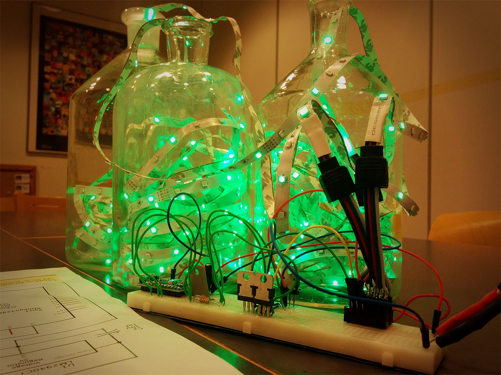

---
Nucleotide-Control-RGB-LEDs
---

An Arduino sketch that blinks RGB LED strips according to a DNA
sequence. Its purpose is to provide an extra dimension to Christmas, and other
decorative, LED ligthing. Therefore, the sktech is preloaded with a
gene sequence from Norway Spruce, *Picea abies*, so that you can put up
a truly *meta* Christmas tree. Or, you can make a Christmas tree shape
from LEDs and have yourself a minimalist *abstract* Christmas.

The code was developed for LED strips with separate R, G, B LEDs,
but it should work just fine with combined RGB LED strips (or single
LEDs), as long as you do the wiring properly. If you run a true RGB LED strip,
where all the LEDs are combined under one lens, it is possible to get better
transitions and more colors with very little code tweaking. The
information on how the code works is contained in the code comments, so be sure to check those out in the Nucleotide-Control-RGB-LEDs.ino file.

Schematic wiring diagrams for the driving circuit are available in the
repository in both .fzz and .PDF formats, with file names
'Nucleotide-Control-RGB-LEDs.fzz', and
'Nucleotide-Control-RGB-LEDs.PDF', respectively.

##List Components
1 x Arduino Pro Nano clone (16 MHz Atmega328P)
3 x 5 m common cathode RGB LED strips
3 x 8.2 kOhm resistors
3 x TIP120 darlington transistors
1 x LM2040CT-5.0 5V Voltage regulator (a 7805 will work fine too)
1 x 1 uF 50 V capacitor
1 x 22 uF 50 V capacitor
1 x Nintendo GameCube 12 V power brick
some differently colored wires (helps with keeping track on which
channel is which)

##To Do's before next holiday season

* Real-time access to send GenBank accession numbers, so
everyone can see their favourite gene, or genome, in action.

* Probably Raspberry Pi integration.

* Analogue knobs to change the variables controlling LED behaviour, such as
gradient, speed, max_intensity *et.c.*

* A fouth "dimension" of some sort to signal if the current nucleotide
is exon or intron (coding, or non coding).

*If I get a proper RGB strip I'll move on to amino acid (protein) sequences.

=======
